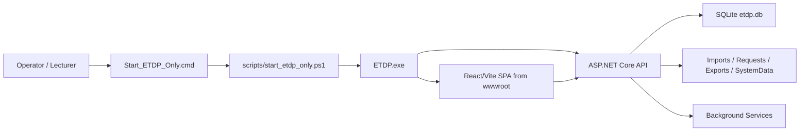
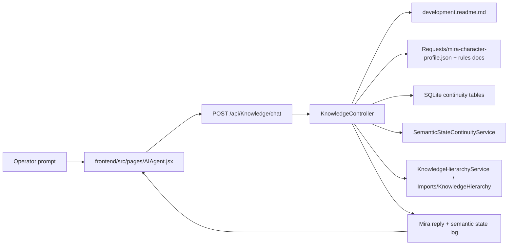
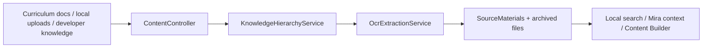
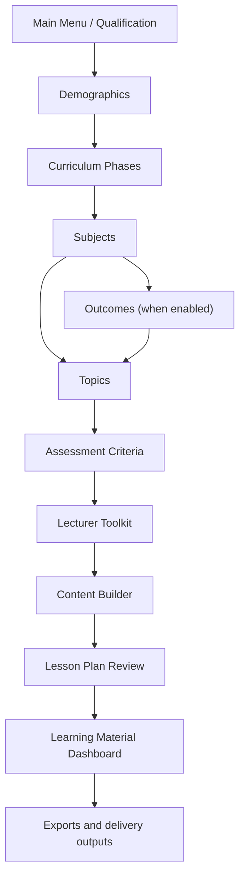

# ETDP Architecture Blueprint

Last verified: March 21, 2026.

This is the human-maintained architecture map for the ETDP application. It is intended to stop architecture knowledge from living only in one coding session or one person's memory.

Primary sources used for this blueprint:
- `Program.cs`
- `frontend/src/main.jsx`
- `frontend/src/App.jsx`
- `Models/ETD.Api/ApplicationDbContext.cs`
- `development.readme.md`
- `codex-startup.md`
- live continuity refresh from `POST /api/Diagnostics/codex-continuity-refresh` on March 21, 2026

Important path note:
- Older repo documents still mention `E:\ETDP`.
- The active workspace on this machine is `F:\ETDP`.
- The currently running packaged ETDP process was verified at `F:\ETDP\ETDP\artifacts\native\backend-win-x64\ETDP.exe`.

## 1. Current Runtime Topology

### 1.1 Verified live machine layout

- Workspace root: `F:\ETDP`
- Repo root: `F:\ETDP\ETDP`
- Backend project: `F:\ETDP\ETDP\ETDP.csproj`
- Frontend source: `F:\ETDP\ETDP\frontend`
- Current packaged backend executable: `F:\ETDP\ETDP\artifacts\native\backend-win-x64\ETDP.exe`
- Current packaged frontend root: `F:\ETDP\ETDP\artifacts\native\backend-win-x64\wwwroot`
- Current SQLite database: `F:\ETDP\ETDP\etdp.db`
- Current packaged continuity output: `F:\ETDP\ETDP\artifacts\native\backend-win-x64\SystemData\CodexContinuity`

### 1.2 Startup modes

ETDP can run in two practical shapes:

1. Development split mode
- Backend: `dotnet run --launch-profile http`
- Frontend: `npm run dev`
- SPA served by Vite, API served by ASP.NET Core

2. Packaged runtime mode
- Launcher: `F:\ETDP\Start_ETDP_Only.cmd`
- PowerShell driver: `F:\ETDP\scripts\start_etdp_only.ps1`
- Backend serves the built SPA from `wwwroot`
- This is the mode currently verified on this machine

### 1.3 Runtime diagram

## 2. Architecture Sources Of Truth

Use these files in this order:

1. `ARCHITECTURE_BLUEPRINT.md`
- Human-maintained system blueprint
- Best first read for understanding structure and change points

2. `codex-startup.md`
- Short coding-session startup map
- Quick orientation for future engineering work

3. `development.readme.md`
- Operational workflow, route, and support knowledge used by ETDP and Mira

4. Generated continuity snapshot
- Packaged runtime path:
  - `artifacts/native/backend-win-x64/SystemData/CodexContinuity/codex-continuity-latest.md`
  - `artifacts/native/backend-win-x64/SystemData/CodexContinuity/codex-continuity-latest.json`
- Purpose:
  - machine-generated runtime inventory of controllers, endpoints, services, DbSets, and key files

5. `workflow.readme.md` and one-click launcher guides
- Cross-system ETDP + SMi operating sequence

## 3. High-Level System Layers

| Layer | Main files | Purpose |
| --- | --- | --- |
| Launch and host | `Program.cs`, `Start_ETDP_Only.cmd`, `scripts/start_etdp_only.ps1` | Starts ETDP, resolves database path, resolves frontend static root, wires services, middleware, and static SPA hosting |
| Frontend shell | `frontend/src/main.jsx`, `frontend/src/App.jsx`, `frontend/src/pages/Dashboard.jsx` | Browser app bootstrapping, API normalization, routing, qualification and activation gates |
| Workflow UI pages | `frontend/src/pages/*.jsx` | Qualification capture, curriculum structure, lecturer toolkit, learning materials, diagnostics, AI screens |
| API controllers | `Controllers/*.cs` | HTTP surface for CRUD, workflow automation, exports, diagnostics, knowledge ingestion, Mira, and integrations |
| Service layer | `Services/*.cs` | Knowledge sync, OCR, AI generation, semantic continuity, automation jobs, continuity snapshots, backups |
| Persistence layer | `Models/ETD.Api/ApplicationDbContext.cs`, model classes, SQLite | Stores curriculum, learning content, exports, automation jobs, diagnostics, and Mira continuity |
| Filesystem content layer | `Imports`, `Requests`, `Exports`, `SystemData`, `artifacts` | Canonical library, Mira config, generated deliverables, runtime state, packaged distribution |

## 4. Repository Map

The most important folders are:

- `Controllers`
  - Backend HTTP endpoints
- `Services`
  - Application orchestration and background logic
- `Models`
  - EF Core entities and database context
- `Migrations`
  - Database schema history
- `frontend/src/pages`
  - Main React page-level screens
- `frontend/src/components`
  - Shared React building blocks such as guards and error handling
- `frontend/src/context`
  - Qualification and glossary cross-page state
- `Requests`
  - Mira character and rules documents, plus request-oriented content assets
- `Imports`
  - Local knowledge and curriculum source material roots
- `Exports`
  - Generated deliverables and working export folders
- `SystemData`
  - Runtime metadata, continuity, backups, and session artifacts
- `artifacts/native/backend-win-x64`
  - Packaged runtime output currently used by the live `F:` launcher

Supporting folders with architectural value:

- `scripts`
  - Start, stop, install, training, and support automation
- `Utils`
  - Runtime mode, path resolution, text cleanup, and document helper logic
- `Security`
  - Key files and auth-related assets

## 5. Backend Blueprint

### 5.1 Startup responsibilities in `Program.cs`

`Program.cs` is the backend composition root. It is responsible for:

- reading and normalizing SQLite connection paths
- resolving project root and packaged/static frontend root
- wiring DI services and hosted background workers
- configuring app authorization and activation behavior
- configuring CORS
- enabling request correlation and exception logging middleware
- creating and migrating the SQLite database
- ensuring operational tables exist
- priming the knowledge hierarchy structure
- serving static frontend files and SPA fallback routes

Key architectural fact:
- the backend can serve either source-built frontend assets or packaged runtime assets depending on what `ResolveFrontendStaticRoot(...)` finds

### 5.2 Controller groups

The live continuity refresh on March 21, 2026 reported:

- 35 controllers
- 292 endpoints
- 25 DbSets

The controller surface is best understood in groups:

1. Core curriculum and workflow data
- `QualificationController`
- `DemographicsController`
- `CurriculumPhaseController`
- `QualificationPhaseController`
- `SubjectController`
- `OutcomeController`
- `TopicController`
- `SubtopicController`
- `ActivityController`
- `AssessmentCriteriaController`
- `LessonPlanController`
- `LecturerToolkitController`

2. Learning-material generation and exports
- `LearnerGuideController`
- `KnowledgeQuestionnaireController`
- `WorkbookController`
- `LearningScheduleController`
- `ProjectRolloutController`
- `ChartsController`
- `ElectricBookExportController`
- `AssessmentComplianceController`
- `TextToVideoController`

3. Knowledge ingestion, AI support, and Mira
- `KnowledgeController`
- `ContentController`
- `QualityCouncilCurriculaController`
- `CurriculumPipelineController`
- `RepoIntegrationController`

4. Operational support and diagnostics
- `ActivationController`
- `DiagnosticsController`
- `AutomationController`
- `AdminController`
- `CodeController`
- `TemplatesController`
- `LearningMaterialController`
- `QualityController`

### 5.3 Service groups

The `Services` folder currently contains the main human-authored service implementations. The generated continuity snapshot reports many more service types because it also counts nested helper types and compiler-generated classes.

The key services are:

- `KnowledgeHierarchyService`
  - canonical knowledge library structure
  - upload readme generation
  - qualification knowledge sync
  - OCR-driven material ingestion
  - developer knowledge coverage reports

- `OcrExtractionService`
  - OCR and text extraction support for PDFs and images

- `SemanticKernelQuestionService`
  - optional OpenAI/Semantic Kernel question generation
  - used by questionnaire/workbook flows when cloud mode is allowed

- `SemanticStateContinuityService`
  - computes Mira continuity metrics
  - produces semantic-state snapshots, drift, anchor retention, and prompt influence summaries

- `KnowledgeQuestionnaireV1Service`
  - questionnaire draft and classification logic

- `CurriculumPipelineService`
- `CurriculumKnowledgeScanService`
- `CurriculumDeliveryPilotService`
  - cognitive scan, curriculum import, mapping, seed lesson drafts, and pilot pipeline orchestration

- `AutomationJobWorker`
  - queued background execution for automation jobs

- `CodexContinuityService`
  - machine-generated architecture memory
  - writes runtime continuity snapshots and ledgers

- `WorkspaceBackupService`
  - mirrored backups and periodic snapshots

- `RequestCorrelationMiddleware`
- `ExceptionLoggingMiddleware`
  - request tracing and runtime error persistence

## 6. Data And Persistence Blueprint

### 6.1 Core database shape

`ApplicationDbContext` is the single EF Core context for ETDP.

Primary data groups:

1. Curriculum structure
- `Qualifications`
- `Demographics`
- `CurriculumPhases`
- `QualificationPhases`
- `Subjects`
- `Outcomes`
- `Topics`
- `Subtopics`
- `Activities`
- `AssessmentCriteria`
- `LessonPlans`

2. Delivery and learner-output content
- `LecturerToolkitEntries`
- `LearnerGuides`
- `Workbooks`
- `KnowledgeQuestionnaires`
- `SmiContentQuestionnaires`
- `SourceMaterials`
- `LearnerRegistrations`
- `WorkExperienceLogbooks`
- `WorkExperienceLogbookEntries`

3. Operations, diagnostics, and AI continuity
- `AutomationJobs`
- `SystemErrorLogs`
- `SmiConversationArchives`
- `SmiSemanticStateSnapshots`
- `SmiTaskTableItems`

### 6.2 Startup-created operational tables

`EnsureOperationalTables(...)` also creates or ensures operational tables beyond normal entity wiring, including:

- Mira/SMI conversation archive tables
- semantic-state snapshot tables
- task-table state
- SANS metadata and proposed mapping tables

This means the database is both:
- a normal business-data store for curriculum and exports
- an operational memory store for diagnostics and AI continuity

## 7. Frontend Blueprint

### 7.1 Frontend bootstrap

`frontend/src/main.jsx` is the frontend runtime shell. It:

- boots React
- wraps the app in `BrowserRouter`
- provides qualification and glossary context
- normalizes API URLs
- injects activation/API headers into `fetch`
- applies dev fallback behavior for `/api` requests
- emits client diagnostics events

### 7.2 Route structure

`frontend/src/App.jsx` is the route registry.

The route tree is organized under:

- `RequireActivation`
  - activation gate before main app access
- `Dashboard`
  - main application shell
- `RequireQualification`
  - qualification-scoped pages
- `RequireWorkflow`
  - prerequisite enforcement for ordered workflow pages

### 7.3 Main page families

1. Core workflow capture pages
- `MainPage.jsx`
- `DemographicsPage.jsx`
- `CurriculumPhasesPage.jsx`
- `SubjectsPage.jsx`
- `OutcomesPage.jsx`
- `TopicsPage.jsx`
- `LecturerToolkitPage.jsx`
- `ContentBuilderPage.jsx`
- `LessonPlanReview.jsx`

2. Review and list pages
- `QualificationReview.jsx`
- `DemographicsReview.jsx`
- `PhasesReview.jsx`
- `SubjectsReview.jsx`
- `TopicsReview.jsx`
- list variants for subjects, topics, assessment criteria, and lesson plans

3. Learning Material Dashboard and export pages
- `LearningMaterialPage.jsx`
- schedule, rollout, learner guide, workbook, memoranda, slides, learner registration, logbook, progress report, template uploads, flow diagrams

4. AI, diagnostics, and support pages
- `AIAgent.jsx`
- `AutomationJobsPage.jsx`
- `SystemDiagnosticsPage.jsx`
- `UserGuidePage.jsx`
- `ActivationPage.jsx`

5. Integration and advanced tooling pages
- `QualityCouncilCurriculaPage.jsx`
- `RepoIntegrationHubPage.jsx`
- `TextToVideoEditorPage.jsx`
- `LecturerAssistancePage.jsx`
- `Wan21Page.jsx`

### 7.4 Shared frontend building blocks

Important supporting files:

- `components/RequireWorkflow.jsx`
  - blocks pages until prerequisite workflow data exists
- `context/QualificationContext.jsx`
  - stores active `qualificationId` in frontend state and local storage
- `components/GlossaryAutoTagger.jsx`
  - automatically surfaces glossary-aware terminology support
- `components/ErrorBoundary.jsx`
- `components/ScriptErrorWarning.jsx`
  - runtime hardening and operator visibility

## 8. Mira Architecture Blueprint

Mira is not a standalone app. Mira is a subsystem inside ETDP.

### 8.1 Mira responsibility split

- `ETDP` owns:
  - SQLite continuity archive
  - semantic-state history
  - qualification task tracking
  - workflow warnings and safe-step guidance

- `Mira` is:
  - the outward conversational teaching persona
  - the user-facing assistant in the UI

- `SMi` is:
  - optional external research/compute support
  - not the core in-app continuity owner

### 8.2 Mira runtime flow

### 8.3 Mira source files

Primary Mira-related files:

- frontend:
  - `frontend/src/pages/AIAgent.jsx`
  - `frontend/src/pages/AIAgentChat.jsx`

- backend:
  - `Controllers/KnowledgeController.cs`
  - `Services/SemanticStateContinuityService.cs`
  - `Services/KnowledgeHierarchyService.cs`

- persistence:
  - `SmiConversationArchives`
  - `SmiSemanticStateSnapshots`
  - `SmiTaskTableItems`

- content/config:
  - `development.readme.md`
  - `Requests/*` Mira profile and advanced-rules files

## 9. Knowledge And Content Ingestion Blueprint

Knowledge ingestion is filesystem-heavy and local-first.

### 9.1 Canonical library model

The canonical qualification library model is:

- `Imports/KnowledgeHierarchy/<QualificationCode>_<QualificationDescription>/`

Typical child structure includes:

- curriculum library material
- local source upload inbox/archive
- developer knowledge inbox/archive
- coverage reports

### 9.2 Ingestion flow

### 9.3 Important ingestion entry points

- `POST /api/Content/upload-material`
- `POST /api/Content/upload-developer-knowledge`
- `POST /api/Content/sync-knowledge-hierarchy`
- `POST /api/Content/import-local-folder`
- `POST /api/Content/import-github-repo`
- `POST /api/Content/index-qualification-knowledge`
- `POST /api/Content/consolidate-knowledge-hierarchy`

## 10. Curriculum Workflow Blueprint

This is the operational backbone of ETDP:

Guard policy:

- pages are blocked when prerequisites are missing
- qualification selection is a global prerequisite for most operational screens
- `RequireWorkflow` enforces ordered progression

## 11. Export Blueprint

Export generation is split by controller and by workflow page.

Main export families:

- Learner Guide
  - controller: `LearnerGuideController.cs`
  - frontend pages: `LearnerGuidePage.jsx`, `LearningMaterialLearnerGuidePage.jsx`

- Knowledge Questionnaire and memoranda
  - controller: `KnowledgeQuestionnaireController.cs`
  - frontend pages: `KnowledgeQuestionnairePage.jsx`, `LearningMaterialSummativeAssessmentPage.jsx`, memoranda pages

- Workbook and memoranda
  - controller: `WorkbookController.cs`
  - frontend pages: `WorkbookPage.jsx`, `LearningMaterialWorkbookPage.jsx`, memoranda page

- Learning schedule
  - controller: `LearningScheduleController.cs`
  - frontend page: `LearningMaterialSchedulePage.jsx`

- Project rollout
  - controller: `ProjectRolloutController.cs`
  - frontend page: `LearningMaterialRolloutPage.jsx`

- Graphs and flow diagrams
  - controller: `ChartsController.cs`
  - frontend pages: `GraphsPage.jsx`, `LearningMaterialFlowDiagramsPage.jsx`

- PowerPoint and text-to-video
  - controllers: `ContentController.cs`, `TextToVideoController.cs`
  - frontend pages: `PowerPointSlidesPage.jsx`, `LearningMaterialSlidesPage.jsx`, `TextToVideoEditorPage.jsx`

## 12. Diagnostics, Continuity, And Safety Blueprint

ETDP already contains internal architecture-memory and runtime-safety mechanisms:

- `DiagnosticsController`
  - server info
  - client error capture
  - OCR status
  - backup status
  - Codex continuity status and refresh

- `CodexContinuityService`
  - periodically writes architecture snapshots
  - provides a machine-generated inventory for future coding sessions

- `WorkspaceBackupService`
  - mirrors workspace state and keeps snapshots

- activation/auth stack
  - `ActivationController`
  - `AppAuthorizationMiddleware`
  - appsettings/environment/key-file controls

## 13. Where To Change Things

Use this section as the practical enhancement map.

| Change type | Start here |
| --- | --- |
| Add or change a screen | `frontend/src/App.jsx` plus the matching page file under `frontend/src/pages` |
| Add or change a CRUD/data API | matching controller in `Controllers` plus entity wiring in `ApplicationDbContext` if persistence changes |
| Change Mira UI behavior | `frontend/src/pages/AIAgent.jsx` |
| Change Mira backend logic or prompts | `Controllers/KnowledgeController.cs`, `Services/SemanticStateContinuityService.cs`, `Requests/*`, `development.readme.md` |
| Change knowledge ingestion or OCR | `Controllers/ContentController.cs`, `Services/KnowledgeHierarchyService.cs`, `Services/OcrExtractionService.cs` |
| Change learning-material exports | matching export controller plus corresponding learning-material page |
| Change startup/runtime resolution | `Program.cs`, `scripts/start_etdp_only.ps1`, launcher `.cmd` files |
| Change architecture memory itself | this file, `codex-startup.md`, `development.readme.md`, and `CodexContinuityService` if automation shape must change |

## 14. Recommended Maintenance Rule

Whenever architecture changes, update all four of these together:

1. `ARCHITECTURE_BLUEPRINT.md`
2. `codex-startup.md`
3. `development.readme.md`
4. generated continuity snapshot via `POST /api/Diagnostics/codex-continuity-refresh`

That rule keeps:

- one human blueprint
- one short startup map
- one operational workflow knowledge base
- one machine-generated inventory

in sync.
